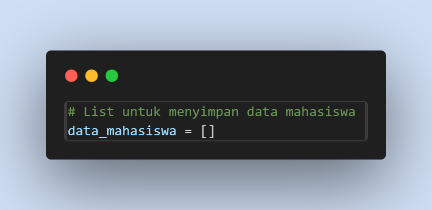
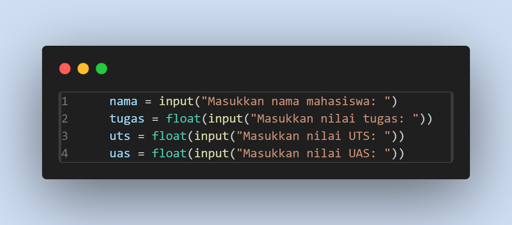
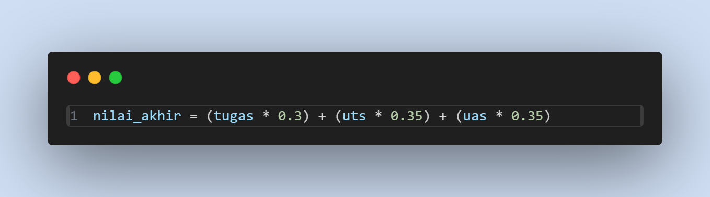
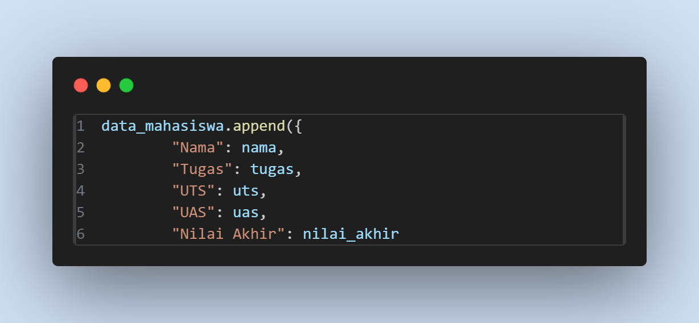
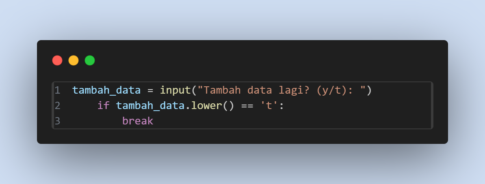
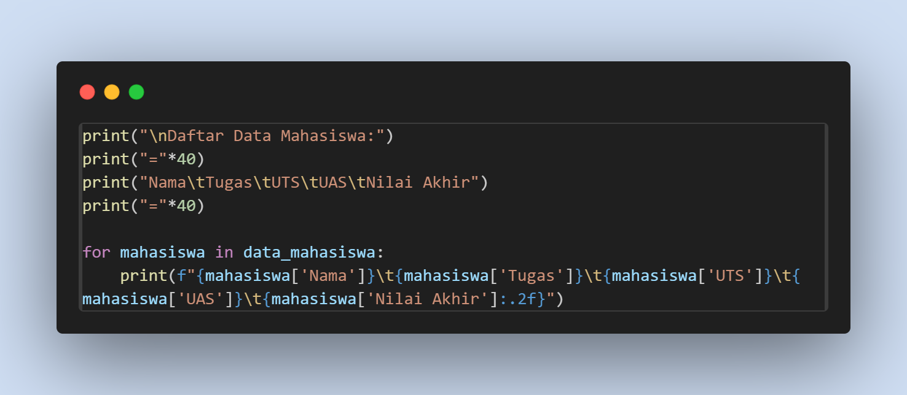
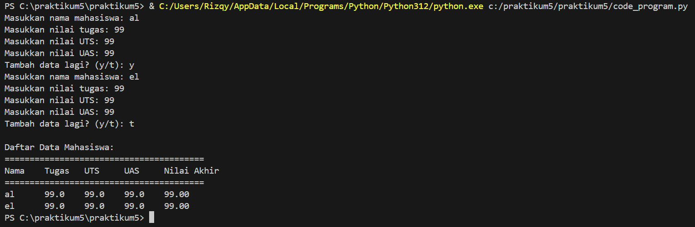

# praktikum5
## 1 Inisialisasi List Kosong

Buat list kosong untuk data_mahasiswa yang akan digunakan untuk menyimpan data setiap mahasiswa.

## 2 Memasukkan Data Mahasiswa

Program meminta memasukkan nama,nilai tugas, UTS, dan UAS.

## 3 Menghitung Nilai Akhir

Menghitung nilai akhir dengan bobot masing-masing komponen (tugas 30%, UTS 35%, dan UAS 35%).

## 4 Menyimpan Data Ke List
Menyimpan data dalam bentuk dictionary dan menambahkannya ke list data_mahasiswa.

## 5 Menambah Data?
Menanyakan apakah pengguna ingin menambah data lagi atau tidak. Jika jawaban adalah 't', program keluar dari loop.

## 6 Menampilkan Daftar Mahasiswa
Menampilkan seluruh data mahasiswa dalam format tabel setelah keluar dari loop.

## Hasil Jadi Program

